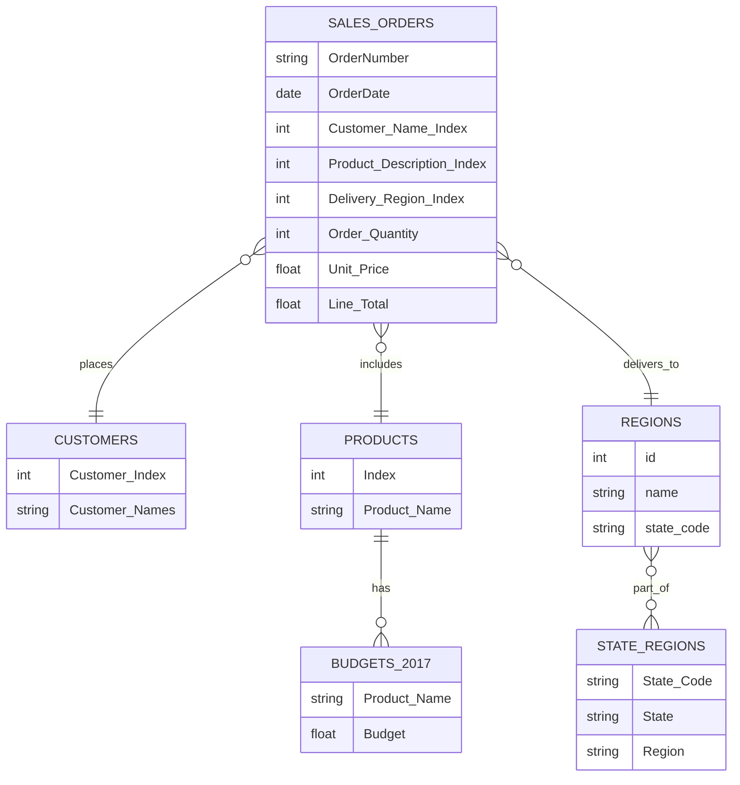

# XYZ Analytics Regional Sales Analysis
## Problem Statement
Sales teams often lack a clear, data-driven understanding of regional performance, making it difficult to identify growth opportunities and identify resources. This project aims to analyze and visualize regional sales data to uncover trends, evaluate profitability, and support strategic decision-making.
* **Business Questions**
  - Inconsistent revenue and profit performance across U.S. regions
  - Lack of visibility into seasonal swings, top SKUs and channel profitability
  - **Goal: Leverage 5 years of historical data to pinpoint growth levers and optimize strategy**
## Approach
**1. Exploratory Data Analysis:**
  - Dive into historical sales, margins, products, channels, regions
  - Surface trend, outliers and relationships

**2. Interactive Dashboard:**
  - Build a live view for business users to self-serve insights
  - Enable ad-hoc slicing by time, product, region, channel
## Data Overview

## Project Workflow
* **Define Busines Objective:** Understand the core problem and expected business outcomes.
* **Collect & Consolidate Data:** Gather multi-source sales data and understand schema.
* **Data Loading & Initial Exploration:** Load into Colab/Jupyter Notebook for initial profiling and data understanding using Python.
* **Pre-processing & Cleaning:** Handle nulls, join tables, format dates and normalize columns.
* **Exploratory Data Analysis (EDA):** Visualize trends, compare performance, and extract key insights.
* **Dashboarding & Recommendations:** Build Power BI dashboard and present strategic findings.
## Exploratory Data Analysis
## Key Insights
### Executive Overview & Trends
### Product & Channel Performance
### Geographic & Customer Insights
## Recommendations
