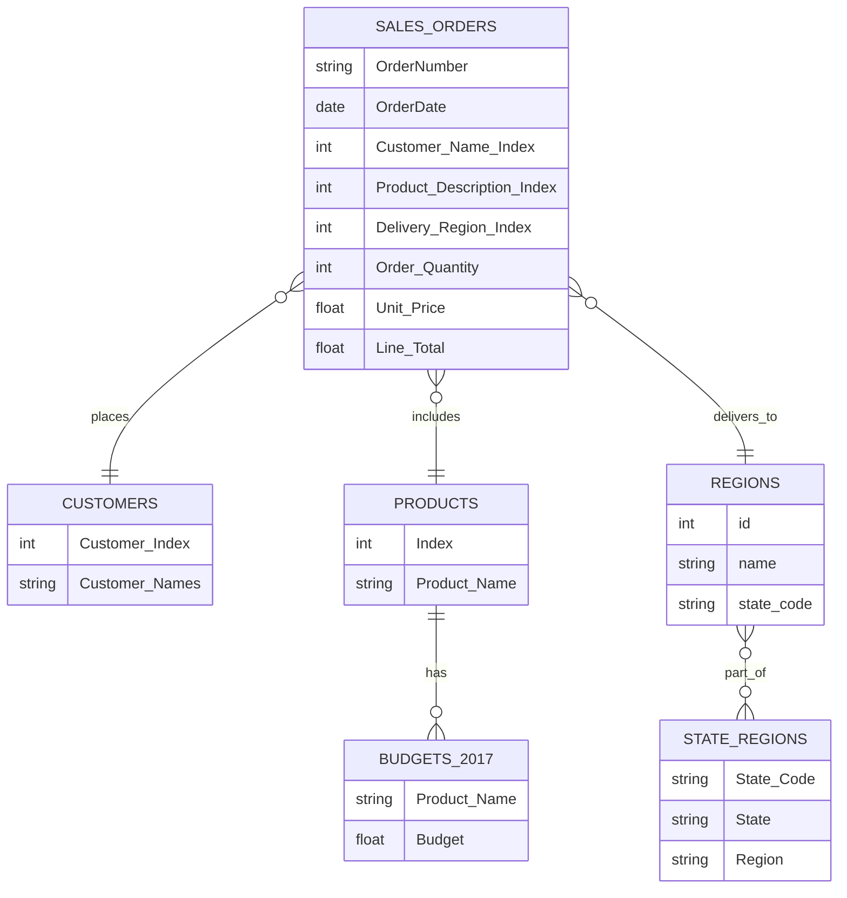

# Acme Analytics Regional Sales Analysis
## Project Summary
This project dives into Acme Co.’s 2014–2018 USA sales dataset through:
* **Data Profiling & Cleaning:** Verified schema, handled missing budgets, and corrected data types.
* **Univariate & Bivariate Analysis:** Explored distributions (revenue, margin, unit price), product/channel/region breakdowns, and customer segments.
* **Trend & Seasonality:** Charted monthly and yearly sales patterns, highlighting recurring surges and dips.
* **Outlier Detection:** Identified extreme transactions at both ends of the revenue and unit-price spectra.
* **Correlation & Segmentation:** Assessed relationships between key metrics and clustered customers by revenue vs. profit margin.
## Problem Statement
Analyze Acme Co.’s 2014–2018 sales data to identify key revenue and profit drivers across products, channels, and regions; uncover seasonal trends and outliers; and align performance against budgets. Use these insights to optimize pricing, promotions, and market expansion for sustainable growth and reduced concentration risk.
* **Business Questions**
  - Inconsistent revenue and profit performance across U.S. regions
  - Lack of visibility into seasonal swings, top SKUs and channel profitability
## Objectives
Deliver actionable insights from Acme Co.’s 2014–2018 sales data to:
* Identify top-performing products, channels, and regions driving revenue and profit
* Uncover seasonal trends and anomalies for optimized planning
* Spot pricing and margin risks from outlier transactions
* Inform pricing, promotion, and market-expansion strategies

These findings will guide the design of a Power BI dashboard to support strategic decision-making and sustainable growth.
## Entity Relationship Diagram

## Project Workflow
* **Define Busines Objective:** Understand the core problem and expected business outcomes.
* **Collect & Consolidate Data:** Gather multi-source sales data and understand schema.
* **Data Loading & Initial Exploration:** Load into Colab/Jupyter Notebook for initial profiling and data understanding using Python.
* **Pre-processing & Cleaning:** Handle nulls, join tables, format dates and normalize columns.
* **Exploratory Data Analysis (EDA):** Visualize trends, compare performance, and extract key insights.
* **Dashboarding & Recommendations:** Build Power BI dashboard and present strategic findings.
## Exploratory Data Analysis
### *1. Monthly Sales Trend over Time*
* **Goal:** Track revenue trends over time to detect seasonality or sales spikes
* **Chart:** Line chart
* **EDA Type:** Temporal (time series)
* **Structure:** Line with markers to highlight monthly revenue points clearly
### *Insights*
* Sales consistently cycle between 24M and 26M, with clear peaks in late spring to early summer (May–June) and troughs each January.
* The overall trend remains stable year over year, reflecting a reliable seasonal demand pattern.
* However, the sharp revenue drop in early 2017 stands out as an outlier, warranting closer investigation into potential causes such as market disruptions or mistimed promotions.
### *2. Monthly Sales Trend (all years combined)*
* **Goal:** Highlight overall seasonality patterns by aggregating sales across all years for each calendar month
* **Chart:** Line chart
* **EDA Type:** Temporal (time series)
* **Structure:** Line with markers, months ordered January to December based on month number
### *Insights*
* Across all years, January begins strong with roughly 99M, followed by a steep decline through April's slowpoint(≈ 95M).
* Sales rebound in May and August (≈ 102M) before settling into a pleateau of 99-101M from September to December.
* This pattern reveals a strong post–New Year surge, a spring dip, and a mid–summer bump each calendar year.
### 3. *Top 10 Products by Revenue (in Millions)*
* **Goal:**  Identify the highest-grossing products to focus marketing and inventory efforts
* **Chart:** Horizontal Bar chart
* **EDA Type:** Univariate
* **Structure:**  Bars sorted descending to show top 10 products with revenue scaled in millions
### *Insights*
* Products 26 and 25 pull away at 112M and 105M, with a sharp drop to 75M for Product 13 and a tight mid-pack at 64-72M.
* The bottom four cluster at 50-55M, highlighting similar constraints.
* Focus on growth pilots for the mid-tier and efficiency gains for the lower earners to drive significant lifts.
### 4. *Top 10 Products by Average Profit Margin*
* **Goal:**  Compare average profitability across products to identify high-margin items
* **Chart:** Horizontal Bar chart
* **EDA Type:** Univariate
* **Structure:**  Bars sorted descending to show top 10 products with average profit margin values
### *Insights*
* Products 18 and 28 lead with average profit margins of approximately 
* Mid-tier performers like Products 12, 26, and 21 cluster in the
* Focusing on margin optimization strategies from top performers may help elevate overall product profitability.
## Recommendations
