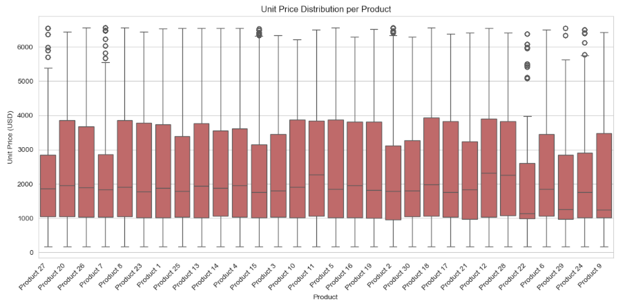

# Acme Analytics Regional Sales Analysis
## Project Summary
This project dives into Acme Co.’s 2014–2018 USA sales dataset through:
* **Data Profiling & Cleaning:** Verified schema, handled missing budgets, and corrected data types.
* **Univariate & Bivariate Analysis:** Explored distributions (revenue, margin, unit price), product/channel/region breakdowns, and customer segments.
* **Trend & Seasonality:** Charted monthly and yearly sales patterns, highlighting recurring surges and dips.
* **Outlier Detection:** Identified extreme transactions at both ends of the revenue and unit-price spectra.
* **Correlation & Segmentation:** Assessed relationships between key metrics and clustered customers by revenue vs. profit margin.
## Problem Statement
Analyze Acme Co.’s 2014–2018 sales data to identify key revenue and profit drivers across products, channels, and regions; uncover seasonal trends and outliers; and align performance against budgets. Use these insights to optimize pricing, promotions, and market expansion for sustainable growth and reduced concentration risk.
* **Business Questions**
  - Inconsistent revenue and profit performance across U.S. regions
  - Lack of visibility into seasonal swings, top SKUs and channel profitability
## Objectives
Deliver actionable insights from Acme Co.’s 2014–2018 sales data to:
* Identify top-performing products, channels, and regions driving revenue and profit
* Uncover seasonal trends and anomalies for optimized planning
* Spot pricing and margin risks from outlier transactions
* Inform pricing, promotion, and market-expansion strategies

These findings will guide the design of a Power BI dashboard to support strategic decision-making and sustainable growth.
## Entity Relationship Diagram

## Project Workflow
* **Define Busines Objective:** Understand the core problem and expected business outcomes.
* **Collect & Consolidate Data:** Gather multi-source sales data and understand schema.
* **Data Loading & Initial Exploration:** Load into Colab/Jupyter Notebook for initial profiling and data understanding using Python.
* **Pre-processing & Cleaning:** Handle nulls, join tables, format dates and normalize columns.
* **Exploratory Data Analysis (EDA):** Visualize trends, compare performance, and extract key insights.
* **Dashboarding & Recommendations:** Build Power BI dashboard and present strategic findings.
## Exploratory Data Analysis
### *1. Monthly Sales Trend over Time*
* **Goal:** Track revenue trends over time to detect seasonality or sales spikes
* **Chart:** Line chart
* **EDA Type:** Temporal (time series)
* **Structure:** Line with markers to highlight monthly revenue points clearly

### *Insights*
* Sales consistently cycle between 24M and 26M, with clear peaks in late spring to early summer (May–June) and troughs each January.
* The overall trend remains stable year over year, reflecting a reliable seasonal demand pattern.
* However, the sharp revenue drop in early 2017 stands out as an outlier, warranting closer investigation into potential causes such as market disruptions or mistimed promotions.
### *2. Monthly Sales Trend (all years combined)*
* **Goal:** Highlight overall seasonality patterns by aggregating sales across all years for each calendar month
* **Chart:** Line chart
* **EDA Type:** Temporal (time series)
* **Structure:** Line with markers, months ordered January to December based on month number

### *Insights*
* Across all years, January begins strong with roughly 99M, followed by a steep decline through April's slowpoint(≈ 95M).
* Sales rebound in May and August (≈ 102M) before settling into a pleateau of 99-101M from September to December.
* This pattern reveals a strong post–New Year surge, a spring dip, and a mid–summer bump each calendar year.
### 3. *Top 10 Products by Revenue (in Millions)*
* **Goal:**  Identify the highest-grossing products to focus marketing and inventory efforts
* **Chart:** Horizontal Bar chart
* **EDA Type:** Univariate
* **Structure:**  Bars sorted descending to show top 10 products with revenue scaled in millions

### *Insights*
* Products 26 and 25 pull away at 112M and 105M, with a sharp drop to 75M for Product 13 and a tight mid-pack at 64-72M.
* The bottom four cluster at 50-55M, highlighting similar constraints.
* Focus on growth pilots for the mid-tier and efficiency gains for the lower earners to drive significant lifts.
### 4. *Top 10 Products by Average Profit Margin*
* **Goal:**  Compare average profitability across products to identify high-margin items
* **Chart:** Horizontal Bar chart
* **EDA Type:** Univariate
* **Structure:**  Bars sorted descending to show top 10 products with average profit margin values

### *Insights*
* Products 18 and 28 lead with average profit margins of approximately 
* Mid-tier performers like Products 12, 26, and 21 cluster in the
* Focusing on margin optimization strategies from top performers may help elevate overall product profitability.
### 5. *Sales by Channel*
* **Goal:**  Show distribution of total sales across channels to identify dominant sales routes
* **Chart:** Pie chart
* **EDA Type:** Univariate
* **Structure:**  Pie segments with percentage labels, colors for clarity, start angle adjusted

### *Insights*
* Wholesale accounts for 54.1% of sales, with distributors at 31.3% and exports at 14.6%, underscoring reliance on domestic bulk channels.
* To diversify revenue and mitigate concentration risk, prioritize expanding export initiatives—through targeted overseas marketing and strategic partner relationships.
### 6. *Average Order Value (AOV) Distribution*
* **Goal:**  Understand distribution of order values to identify typical spending levels and outliers
* **Chart:** Histogram
* **EDA Type:** Univariate
* **Structure:**  Histogram with 50 bins, colored bars with edge highlights to show frequency of order values

### *Insights*
* The order‐value distribution is heavily right‐skewed, with most orders clustering between 20-120K and a pronounced mode around 50-60 K.
* A long tail of high-value transactions extends up toward 400-500K, but these large orders represent only a small share of total volume.
### 7. *Profit Margin % vs. Unit Price*
* **Goal:** Examine relationship between unit price and profit margin percentage across orders
* **Chart:** Scatter plot
* **EDA Type:** Bivariate
* **Structure:** Scatter points with transparency to show data density

### *Insights*
* Profit margins are concentrated between 18% and 60%, with no clear correlation to unit price, which spans from near 0 to over 6,500.
* Dense horizontal bands indicate consistent margin tiers across a wide price spectrum, reflecting uniform pricing strategies.
* Outliers below 18% at both low and high price points may signal cost inefficiencies or pricing issues worth deeper investigation.
###  8. *Unit Price Distribution per Product*
* **Goal:** Compare pricing variability across different products to identify price consistency and outliers
* **Chart:** Boxplot
* **EDA Type:** Bivariate
* **Structure:** Boxplot with rotated labels to display unit price spread per product

### *Insights*
* Products 8, 17, 27, 20, and 28 show high-end revenue spikes - well above their upper whiskers, likely due to bulk orders, special-edition releases, or premium bundles that temporarily inflate earnings.
* In contrast, deep low-end outliers (near 0-100) on Products 20 and 27 suggest promotional giveaways or test SKUs that pull down average prices.
* To ensure accurate margin and pricing assessments, exclude these outlier transactions from average calculations.
* Then assess whether such anomalies warrant formalization as ongoing promotional strategies or should be phased out to stabilize pricing performance.
###  9. *Total Sales by US Region*
* **Goal:** Compare total sales across U.S. regions to identify top‑performing markets and areas for targeted growth.
* **Chart:** Horizontal bar chart
* **EDA Type:** Univariate comparison
* **Structure:** Bars sorted ascending (Northeast → West) for clear bottom‑to‑top ranking. X‑axis in millions USD, Y‑axis listing regions

### *Insights*
* West dominates with roughly 360M in sales (35% of total), underscoring its market leadership
* South & Midwest each contribute over 320M (32% of total), indicating strong, consistent demand across central regions.
* Northeast trails at about $210 M (~20 %), signaling room for growth and targeted investment.
* Action: Focus on closing the Northeast gap with local promotions and strategic partnerships, while maintaining national playbook success
###  10. *Total Sales by State*
* **Goal:** Visualize geographic distribution of sales to identify high- and low-performing states and uncover regional gaps.
* **Chart:** US choropleth map
* **EDA Type:** Univariate geospatial
* **Structure:**
    * States shaded by total sales (in millions USD) using a blue gradient
    * Legend on the right showing sales scale (M USD)
    * Hover tooltips display exact sales for each state
    * Map scoped to USA for clear regional context

### *Insights*
* California leads with 230M followed by Illinois (111M) and Florida (90M).
* Mid‑tier states (e.g. Texas - 55 M) hold steady performance but trail the top three by 40–145M. Lower‑tier states (e.g. New Jersey - 35 M) reveal a gradual drop, indicating uneven market penetration.
* Action: Double down on top states with tailored promotions, and launch targeted growth initiatives in under‑penetrated regions to close the gap
### 11. *Top and Bottom 10 Customers by Revenue*
* **Goal:** Identify your highest- and lowest-revenue customers to tailor engagement strategies
* **Chart:** Side-by-side horizontal bar charts
* **EDA Type:** Multivariate
* **Structure:** Left chart shows top 10 customers by revenue (in millions), right chart shows bottom 10 customers by revenue (in millions)

### *Insights*
* Aibox Company tops the list with 12.16M followed closely by State Ltd. (11.85M), while the 10th-ranked Vimbo Company still contributes 9.57M demonstrating a tight 10–12 M top tier.
* At the bottom, Roomm Company leads its group with 4.9M, down to BB17 Company at 3.9M - roughly half the top customer’s revenue.
* This steep drop from ~10M to 4–5M highlights high revenue concentration among the top customers.
* Action: prioritize retention and upsell for your top ten, and launch targeted growth campaigns to elevate the lower-revenue cohort.
###  12. *Average Profit Margin by Channel*
* **Goal:** Compare average profit margins across sales channels to identify the most and least profitable routes
* **Chart:** Bar chart
* **EDA Type:** Bivariate
* **Structure:** Vertical bars with data labels showing margin percentages, sorted descending by channel

### *Insights*
* Export leads with a 37.94% average margin, closely followed by Distributor (37.55%) and Wholesale (37.11%).
* The tiny spread (<0.2 %) shows consistently strong profitability across all channels.
* This uniformity implies well-controlled costs and pricing power everywhere.
* To maximize returns, push volume growth in Export while maintaining efficiency in Distributor and Wholesale.
###  13. *Top 10 States by Revenue and Order Count*
* **Goal:** Identify highest revenue-generating states and compare their order volumes
* **Chart:** Two bar charts
* **EDA Type:** Multivariate
* **Structure:** First chart shows top 10 states by revenue (in millions), second shows top 10 states by number of orders

###  14. *Customer Segmentation: Revenue vs. Profit Margin*
* **Goal:** Segment customers by total revenue and average profit margin, highlighting order volume
* **Chart:** Bubble chart (scatter plot with variable point sizes)
* **EDA Type:** Multivariate
* **Structure:** Scatter points sized by number of orders, plotting revenue vs. margin

### *Insights*
* Customers with >10M in revenue tend to sustain margins between 36–40%, indicating that scale does not significantly erode profitability.
* Most customers cluster within the 6–10M range and show stable margins (~34–40%), suggesting consistent pricing in this tier.
* Customers below 6M display the widest margin variance (~33–43%), pointing to more volatile cost structures or discounts among smaller accounts.
* Bubble size (order count) increases with revenue, but margin levels appear unaffected—reinforcing revenue as the dominant performance driver over order volume.
###  15. *Correlation Heatmap of Numeric Features*
* **Goal:** Identify relationships among key numeric variables to uncover potential multicollinearity
* **Chart:** Correlation heatmap
* **EDA Type:** Multivariate
* **Structure:** Annotated heatmap with correlation coefficients for selected numeric columns

### *Insights*
* **Profit** and **revenue** are very strongly correlated (0.87), indicating that as sales value increases, profit tends to rise as well.
* **Unit price** is a key driver: it correlates 0.91 with revenue, 0.79 with profit, and 0.94 with cost—highlighting how pricing decisions ripple through both top‑line and expense figures.
* **Cost** shows a strong link to revenue (0.85) but a more moderate tie to profit (0.58), underscoring that while higher sales often bring higher expenses, margins can still vary.
* **Quantity** has virtually no correlation with unit price or cost (≈0.00) and only modest associations with revenue (0.34) and profit (0.30), making volume a secondary factor compared to pricing.
## Key Insights
* **Monthly Revenue Cycle:** Revenue stays stable between ≈23M-26.5M across 2014–2017, with no consistent seasonal  spikes. Sharpest drop (≈21.2M) occurs in early 2017, indicating a possible one-time disruption.
* **Channel Mix:** Wholesale: 54%. Distributors: 31%. Exports: 15% — opportunity to scale international presence.
* **Top Products (Revenue):** Product 26: 112M; Product 25: 106M; Product 13: 75M. Mid-tier: 65–75M; bottom performers: 50–55M.
* **Profit Margins:** Profit margins range broadly from ≈18% to ≈60%, with no strong correlation to unit price. Dense horizontal bands suggest standardized pricing strategies across tiers.
* **Seasonal Volume:** No strong monthly pattern, but slight volume uptick appears around May–June. Early 2017 dip (≈21.2M) may require investigation.
* **Regional Performance:** California leads: ≈230M Revenue & 7500+ orders. Illinois/Florida/Texas: ≈85M–110M & ≈3500–4500 orders. NY/Indiana: ≈54M & 2000+ orders.
## Recommendations
* **Outlier Strategy:** Exclude or formalize bulk-order and promotional SKUs when calculating averages.
* **Margin Uplift:** Apply top-product pricing levers to mid/low tiers; cut costs on underperformers.
* **Export Growth:** Invest in targeted overseas marketing and distributor partnerships.
* **Seasonal Planning:** Shift spend toward January trough and May–June peak; investigate the 2017 anomaly.
* **Dashboard Prep:** Build aggregated tables for time series, channel mix, and product performance for Power BI.
